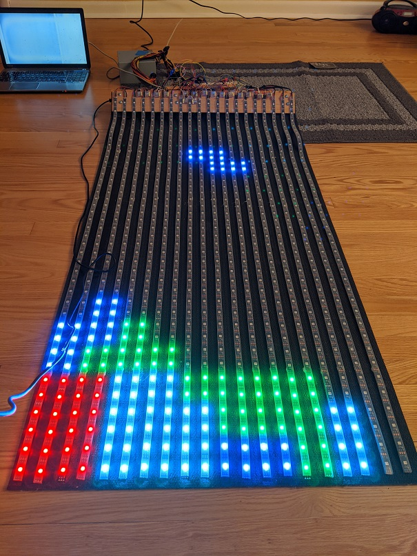

# Tetris

This ended up being a 30-inch by 60-inch Tetris game I hung on my cubicle wall at work for a while. It's running on an Arduino Uno, using 24-bit LEDs for display, with an NES controller for input.

One of the most interesting challenges was that with 800 24-bit LEDs, the total state of the game at any given time exceeds the memory capacity of the Uno, which means most LED-control libraries wouldn't work. I ended up storing the game state in a more compressed format, then calculating and streaming out the LED values on each tick.

Another interesting challenge was with the power. The LED strips require low voltage, but fairly high current. I ended up using an old ATX power supply to provide this, and had to try a couple different thicknesses of wire before I got one with a low enough resistance.

I initially wrote most of the game logic in .NET, so I could more easily debug that while isolating myself from the aspects of the Arduino and physical electronics that were newer to me. Then I modified the .NET code to run on a PC, but send data to the Arduino over a serial port for display purposes. And ultimately migrated all the code to the Arduino.

<a href="https://youtu.be/cFZiP-f9wCc" target="_blank">Check out a video</a>

